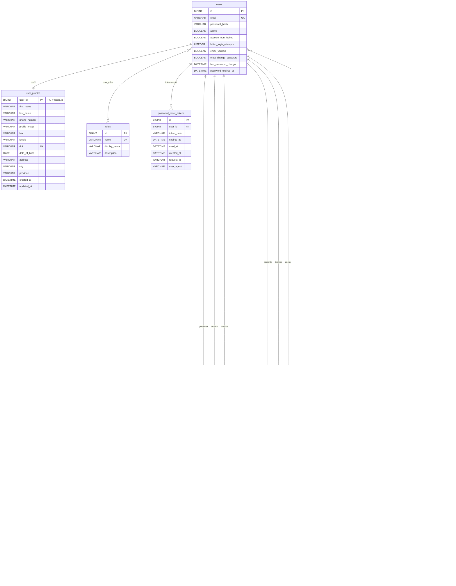

# Diagrama de base de datos — MediLab

```mermaid
erDiagram
    users {
        BIGINT id PK
        VARCHAR email UK
        VARCHAR password_hash
        BOOLEAN active
        BOOLEAN account_non_locked
        INTEGER failed_login_attempts
        BOOLEAN email_verified
        BOOLEAN must_change_password
        DATETIME last_password_change
        DATETIME password_expires_at
    }

    user_profiles {
        BIGINT user_id PK "FK -> users.id"
        VARCHAR first_name
        VARCHAR last_name
        VARCHAR phone_number
        VARCHAR profile_image
        VARCHAR bio
        VARCHAR locale
        VARCHAR dni UK
        DATE date_of_birth
        VARCHAR address
        VARCHAR city
        VARCHAR province
        DATETIME created_at
        DATETIME updated_at
    }

    roles {
        BIGINT id PK
        VARCHAR name UK
        VARCHAR display_name
        VARCHAR description
    }

    user_roles {
        BIGINT user_id FK
        BIGINT role_id FK
    }

    password_reset_tokens {
        BIGINT id PK
        BIGINT user_id FK
        VARCHAR token_hash
        DATETIME expires_at
        DATETIME used_at
        DATETIME created_at
        VARCHAR request_ip
        VARCHAR user_agent
    }

    trailers {
        BIGINT id PK
        VARCHAR codigo UK
        VARCHAR nombre
        BOOLEAN activo
        VARCHAR descripcion
    }

    rutas {
        BIGINT id PK
        BIGINT trailer_id FK
        VARCHAR nombre
        VARCHAR origen
        VARCHAR destino
        BOOLEAN activa
        DATE fecha_inicio
        DATE fecha_fin
        VARCHAR descripcion
        DATETIME created_at
        DATETIME updated_at
    }

    ruta_tecnicos {
        BIGINT ruta_id FK
        BIGINT tecnico_id FK
    }

    paradas {
        BIGINT id PK
        BIGINT ruta_id FK
        VARCHAR nombre
        VARCHAR municipio
        VARCHAR provincia
        VARCHAR direccion
        DECIMAL latitud
        DECIMAL longitud
        INTEGER orden_parada
        DATE fecha
        TIME hora_inicio
        TIME hora_fin
        INTEGER capacidad_maxima
        BOOLEAN activa
        DATETIME created_at
        DATETIME updated_at
    }

    slot_cita {
        BIGINT id PK
        BIGINT parada_id FK
        DATETIME fecha_hora_inicio
        DATETIME fecha_hora_fin
        INTEGER cupo_numero
        VARCHAR estado "DISPONIBLE|RESERVADO|NO_DISPONIBLE"
    }

    cita {
        BIGINT id_cita PK
        BIGINT paciente_id FK
        BIGINT tecnico_id FK
        BIGINT doctor_id FK
        BIGINT slot_id UK "FK -> slot_cita.id"
        VARCHAR tipo_prueba
        VARCHAR estado "PENDIENTE|CONFIRMADA|RESULTADOS_SUBIDOS|RESULTADOS_APROBADOS|CANCELADA"
        DATETIME created_at
        DATETIME updated_at
    }

    registros_clinicos {
        BIGINT id PK
        BIGINT cita_id FK
        BIGINT paciente_id FK
        BIGINT tecnico_id FK
        BIGINT medico_id FK
        VARCHAR tipo_prueba
        TEXT resultado
        TEXT observaciones_tecnico
        TEXT observaciones_medico
        TEXT receta_o_solucion
        VARCHAR estado "BORRADOR|PENDIENTE_REVISION|CONFIRMADO|RECHAZADO"
        DATETIME confirmed_at
        DATETIME created_at
        DATETIME updated_at
    }

    users ||--|| user_profiles : "perfil"
    users ||--o{ password_reset_tokens : "tokens reset"
    users }o--o{ roles : "user_roles"
    users }o--o{ rutas : "ruta_tecnicos"
    users ||--o{ cita : "paciente"
    users ||--o{ cita : "tecnico"
    users ||--o{ cita : "doctor"
    users ||--o{ registros_clinicos : "paciente"
    users ||--o{ registros_clinicos : "tecnico"
    users ||--o{ registros_clinicos : "medico"
    trailers ||--o{ rutas : "trailer_id"
    rutas ||--o{ paradas : "ruta_id"
    paradas ||--o{ slot_cita : "parada_id"
    slot_cita ||--o| cita : "slot_id"
    cita ||--o{ registros_clinicos : "cita_id"
```
