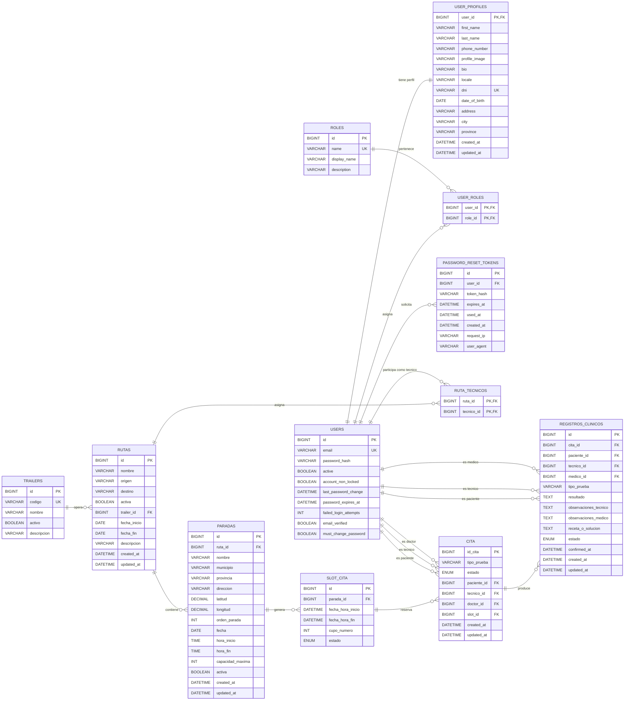

# Modelo ER de la base de datos

Este diagrama está basado en [src/main/resources/schema.sql](/Users/alvaro/school/medilab/medilab-api-asmjbc/src/main/resources/schema.sql:1) y refleja la estructura relacional actual de la base de datos.

## Diagrama ER

## Relaciones clave

- `users` 1:1 `user_profiles`
- `users` N:M `roles` mediante `user_roles`
- `trailers` 1:N `rutas`
- `rutas` N:M `users` como técnicos mediante `ruta_tecnicos`
- `rutas` 1:N `paradas`
- `paradas` 1:N `slot_cita`
- `slot_cita` 1:N `cita`
- `users` 1:N `cita` en tres roles distintos: `paciente`, `tecnico`, `doctor`
- `cita` 1:N `registros_clinicos`
- `users` 1:N `password_reset_tokens`

## Descripcion de tablas y campos

### `users`
Almacena la informacion de autenticacion y el estado de seguridad de cada cuenta.

- `id`: identificador unico del usuario.
- `email`: correo electronico unico utilizado para iniciar sesion.
- `password_hash`: hash de la contrasena almacenada.
- `active`: indica si la cuenta esta activa.
- `account_non_locked`: indica si la cuenta no esta bloqueada.
- `last_password_change`: fecha y hora del ultimo cambio de contrasena.
- `password_expires_at`: fecha y hora de expiracion de la contrasena.
- `failed_login_attempts`: numero de intentos fallidos acumulados.
- `email_verified`: indica si el correo electronico ha sido verificado.
- `must_change_password`: obliga al usuario a cambiar la contrasena en el siguiente acceso.

### `user_profiles`
Contiene los datos personales ampliados del usuario. Tiene relacion 1:1 con `users`.

- `user_id`: clave primaria y clave foranea hacia `users.id`.
- `first_name`: nombre del usuario.
- `last_name`: apellidos del usuario.
- `phone_number`: telefono de contacto.
- `profile_image`: ruta o URL de la imagen de perfil.
- `bio`: descripcion breve o biografia.
- `locale`: idioma o configuracion regional preferida.
- `dni`: documento identificativo del usuario, unico.
- `date_of_birth`: fecha de nacimiento.
- `address`: direccion postal.
- `city`: ciudad.
- `province`: provincia.
- `created_at`: fecha de creacion del perfil.
- `updated_at`: fecha de ultima actualizacion del perfil.

### `roles`
Define el catalogo de roles del sistema.

- `id`: identificador unico del rol.
- `name`: nombre tecnico unico del rol, por ejemplo `ROLE_ADMIN`.
- `display_name`: nombre legible del rol para interfaces.
- `description`: descripcion funcional del rol.

### `user_roles`
Tabla puente para la relacion N:M entre usuarios y roles.

- `user_id`: usuario al que se asigna el rol.
- `role_id`: rol asignado al usuario.

### `trailers`
Guarda las unidades moviles o trailers sanitarios disponibles para operar rutas.

- `id`: identificador unico del trailer.
- `codigo`: codigo interno unico del trailer.
- `nombre`: nombre visible del trailer.
- `activo`: indica si el trailer esta operativo.
- `descripcion`: texto descriptivo opcional.

### `rutas`
Representa las rutas operativas asignadas a un trailer dentro de un periodo de fechas.

- `id`: identificador unico de la ruta.
- `nombre`: nombre de la ruta.
- `origen`: punto de origen de la ruta.
- `destino`: punto de destino de la ruta.
- `activa`: indica si la ruta esta habilitada.
- `trailer_id`: referencia al trailer asignado.
- `fecha_inicio`: fecha de inicio de validez de la ruta.
- `fecha_fin`: fecha de fin de validez de la ruta.
- `descripcion`: informacion adicional sobre la ruta.
- `created_at`: fecha de creacion de la ruta.
- `updated_at`: fecha de ultima actualizacion de la ruta.

### `ruta_tecnicos`
Tabla puente para la relacion N:M entre rutas y usuarios tecnicos.

- `ruta_id`: ruta a la que queda asignado el tecnico.
- `tecnico_id`: usuario tecnico asociado a la ruta.

### `paradas`
Guarda las paradas concretas que se realizan dentro de una ruta en una fecha determinada.

- `id`: identificador unico de la parada.
- `ruta_id`: referencia a la ruta propietaria.
- `nombre`: nombre de la parada.
- `municipio`: municipio donde se realiza.
- `provincia`: provincia donde se realiza.
- `direccion`: direccion postal concreta.
- `latitud`: coordenada geografica de latitud.
- `longitud`: coordenada geografica de longitud.
- `orden_parada`: posicion de la parada dentro de la ruta para esa fecha.
- `fecha`: dia en que se realiza la parada.
- `hora_inicio`: hora de inicio de la operativa.
- `hora_fin`: hora de fin de la operativa.
- `capacidad_maxima`: numero maximo de plazas simultaneas disponibles.
- `activa`: indica si la parada esta habilitada.
- `created_at`: fecha de creacion de la parada.
- `updated_at`: fecha de ultima actualizacion de la parada.

### `slot_cita`
Representa las franjas horarias reservables generadas para una parada.

- `id`: identificador unico del slot.
- `parada_id`: referencia a la parada de la que depende.
- `fecha_hora_inicio`: fecha y hora de inicio del slot.
- `fecha_hora_fin`: fecha y hora de fin del slot.
- `cupo_numero`: numero de cupo dentro de esa franja horaria.
- `estado`: estado del slot, por ejemplo disponible, reservado o no disponible.

### `cita`
Guarda las citas reservadas por los pacientes para una prueba medica.

- `id_cita`: identificador unico de la cita.
- `tipo_prueba`: nombre o categoria de la prueba solicitada.
- `estado`: estado funcional de la cita.
- `paciente_id`: usuario que actua como paciente.
- `tecnico_id`: usuario tecnico asignado a la cita.
- `doctor_id`: usuario doctor asignado a la cita.
- `slot_id`: slot reservado para la cita. Es unico por cita.
- `created_at`: fecha de creacion de la cita.
- `updated_at`: fecha de ultima actualizacion de la cita.

### `registros_clinicos`
Almacena el contenido clinico generado a partir de una cita y su posterior revision medica.

- `id`: identificador unico del registro clinico.
- `cita_id`: referencia a la cita asociada.
- `paciente_id`: usuario paciente relacionado con el registro.
- `tecnico_id`: tecnico que genera el registro.
- `medico_id`: medico que revisa, confirma o rechaza el registro.
- `tipo_prueba`: tipo de prueba al que pertenece el registro.
- `resultado`: resultado principal de la prueba.
- `observaciones_tecnico`: observaciones redactadas por el tecnico.
- `observaciones_medico`: observaciones redactadas por el medico.
- `receta_o_solucion`: tratamiento, receta o solucion propuesta.
- `estado`: estado del registro clinico.
- `confirmed_at`: fecha y hora de confirmacion medica, si existe.
- `created_at`: fecha de creacion del registro.
- `updated_at`: fecha de ultima actualizacion del registro.

### `password_reset_tokens`
Gestiona los tokens usados para la recuperacion de contrasena.

- `id`: identificador unico del token.
- `user_id`: usuario al que pertenece el token.
- `token_hash`: hash del token opaco almacenado.
- `expires_at`: fecha y hora de expiracion.
- `used_at`: fecha y hora en que el token fue consumido.
- `created_at`: fecha de creacion del token.
- `request_ip`: direccion IP desde la que se solicito la recuperacion.
- `user_agent`: agente de usuario del cliente que hizo la solicitud.

## Notas

- `cita.slot_id` es `UNIQUE`, así que un `slot_cita` solo puede estar asociado a una cita.
- `registros_clinicos` no limita a un único registro por `cita`; el modelo actual permite varios registros asociados a la misma cita.
- `ruta_tecnicos` y `user_roles` son tablas puente para relaciones N:M.
